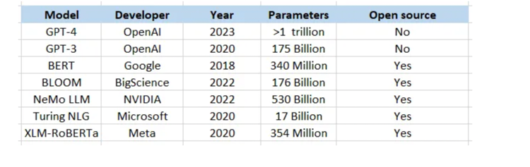

# References
https://blog.devgenius.io/introduction-to-llms-a-cloud-engineers-angle-10812a52475

# What is LLM's

* Large language models (LLMs) are advanced AI models, often based on the Transformer architecture, that excel in processing, interpreting, and generating human language, code, and other content.

## Relationship between transformers and LLM's
The relationship between Transformers and Large Language Models (LLMs) lies in the fact that Transformers serve as the underlying architecture for many LLMs. The Transformer architecture provides the foundation for LLMs, enabling them to effectively understand and generate human language, as well as perform a wide range of natural language processing tasks.

Large Language Models, such as BERT, GPT, and T5, are built on top of the Transformer architecture. They are pre-trained on vast amounts of text data to learn powerful representations of language. These pre-trained models can then be fine-tuned for various downstream NLP tasks, such as text classification, sentiment analysis, question answering, and text generation.

Large Language Models, such as BERT, GPT, and T5, are built on top of the Transformer architecture. They are pre-trained on vast amounts of text data to learn powerful representations of language.

Autoencoding tasks (i.e BERT)

Autoregressive tasks (i.e GPT)

The goal of this task is to learn to predict the next token in a sequence, given the previous tokens. This type of model focuses on capturing the probability distribution of the language and is trained to maximize the likelihood of correctly predicting subsequent tokens.

Autoregressive models like GPT (Generative Pre-trained Transformer) are widely used in LLMs for a variety of natural language processing tasks, such as text generation, translation, and summarization.

Comparison of popular LLM's:

#Key characterstics of LLM's
Key Characteristics of LLMs
LLMs can be categorized into three main buckets:

* Autoregressive models, such as GPT, which predict the next token in a sentence based on the previous tokens. They are effective at generating coherent free-text following a given context

* Autoencoding models, such as BERT, which build a bidirectional representation of a sentence by masking some of the input tokens and trying to predict them from the remaining ones. They are adept at capturing contextual relationships between tokens quickly and at scale which make them great candidates for text classification tasks for example.

* Combinations of autoregressive and autoencoding, like T5, which can use the encoder and decoder to be more versatile and flexible in generating text. It has been shown that these combination models can generate more diverse and creative text in different contexts compared to pure decoder-based autoregressive models due to their ability to capture additional context using the encoder.

